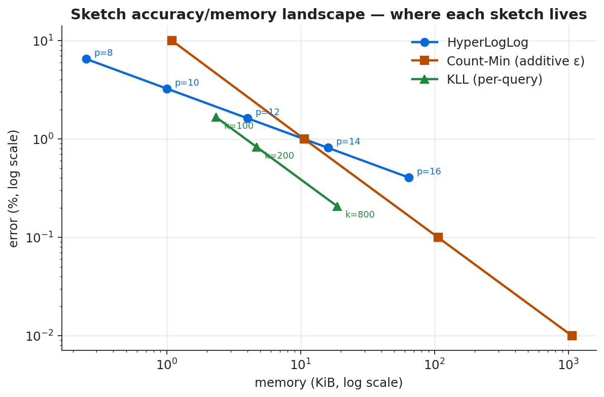
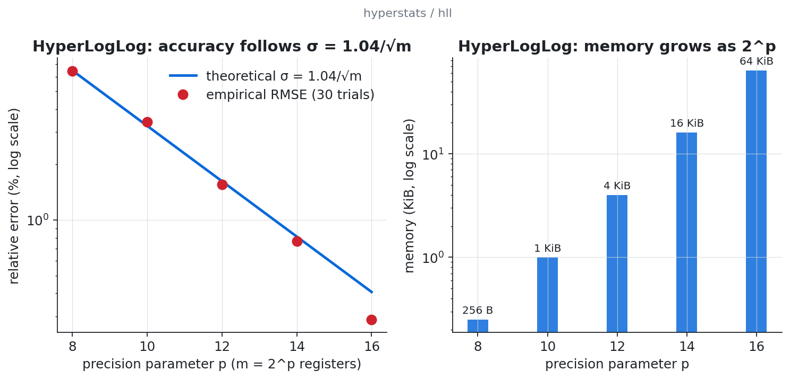
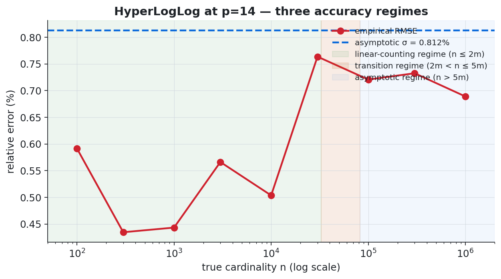
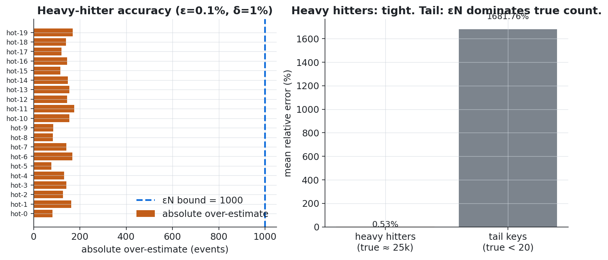
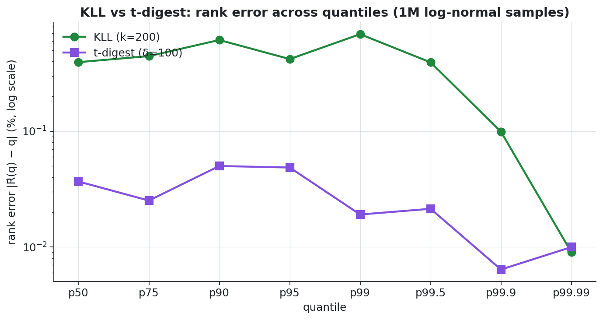
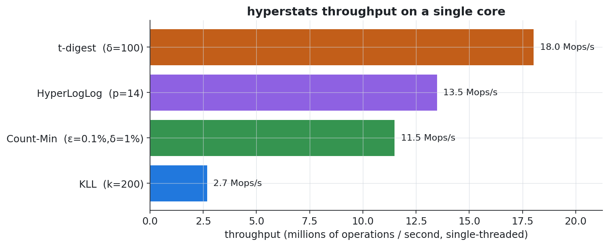

<div align="center">

# hyperstats

**Production-grade streaming sketch algorithms for Go, with mathematically rigorous error bounds and empirical verification.**

[](https://pkg.go.dev/github.com/dystortion/hyperstats)
[](https://goreportcard.com/report/github.com/dystortion/hyperstats)
[](https://github.com/dystortion/hyperstats/actions/workflows/ci.yml)
[](https://github.com/dystortion/hyperstats/actions/workflows/codeql.yml)
[](LICENSE)
[](https://go.dev/)
[](#testing-strategy)

</div>

A dependency-free Go module for answering big-data questions without storing all the data.

### What can I use this for?

Use `hyperstats` when your app is receiving millions of events and you need fast, memory-efficient answers:

- Count approximate unique users, IPs, sessions, products, or events.
- Estimate how often keys appear without keeping a giant map in memory.
- Track p95, p99, and p99.9 latency without storing every request.
- Merge summaries from many servers into one global answer.
- Serialize compact statistics for dashboards, monitoring, storage, or pipelines.

In short: `hyperstats` gives you tiny summaries of huge streams, with clear error bounds.

```bash
go get github.com/dystortion/hyperstats
```

```go
import "github.com/dystortion/hyperstats/hll"

sketch := hll.New(hll.DefaultPrecision) // ~16 KiB, ~0.81% standard error
for _, userID := range stream {
    sketch.AddString(userID)
}
uniqueUsers := sketch.Estimate()
```

`hyperstats` treats documented error bounds as part of the API contract. Each sketch links its guarantee back to the literature, then property tests empirically verify the guarantee across randomized workloads. If an implementation regresses, the tests fail. If a documented bound is too optimistic, the tests fail.

---

## Table of Contents

- [Why hyperstats](#why-hyperstats)
- [Install](#install)
- [Quick start](#quick-start)
- [Sketches](#sketches)
- [Live demo](#live-demo)
- [Accuracy and memory](#accuracy-and-memory)
- [Sketch reference](#sketch-reference)
- [Throughput](#throughput)
- [Mergeability](#mergeability--cross-shard-aggregation)
- [Architecture](#architecture)
- [Testing strategy](#testing-strategy)
- [Roadmap](#roadmap)
- [References](#references)

---

## Why hyperstats

Streaming sketches are useful only when their failure modes are explicit. `hyperstats` is built around four production constraints:

- **Documented accuracy:** every sketch documents the bound it claims to provide.
- **Empirical verification:** property tests check those bounds across many trials.
- **Mergeability:** sketches combine cleanly across shards, regions, and workers.
- **Zero external dependencies:** the library is small enough to embed in critical-path infrastructure.

## Install

```bash
go get github.com/dystortion/hyperstats
```

The module targets Go 1.22+ and exposes each algorithm as an independent sub-package.

## Quick start

```go
package main

import (
    "fmt"

    "github.com/dystortion/hyperstats/hll"
)

func main() {
    sketch := hll.New(hll.DefaultPrecision)
    for _, userID := range []string{"ada", "grace", "ada"} {
        sketch.AddString(userID)
    }

    fmt.Println(sketch.Estimate()) // approximately 2
}
```

Every sketch follows the same shape:

```go
sketch.Add(value)             // or AddString / AddHash where appropriate
result := sketch.Query(...)   // Estimate / Count / Quantile / Rank
err := sketch.Merge(other)    // combine compatible sketches
data, _ := sketch.MarshalBinary()
err = sketch.UnmarshalBinary(data)
```

## Sketches

| Sketch | Question it answers | Memory | Error bound | Mergeable |
|---|---|---|---|---|
| **HyperLogLog** | "How many unique X are in this stream?" | `O(2^p)` | `σ ≈ 1.04/√m` | ✅ exact |
| **Count-Min Sketch** | "How often did key X appear?" | `O((1/ε) ln(1/δ))` | `f̂ - f ≤ εN  w.p. 1-δ` | ✅ exact |
| **KLL** | "What's the p99 of this stream?" | `O(k)` | `ε ≈ 5/k` (sup over q) | ✅ exact |
| **t-digest** | "What's the p99 of this stream?" | `O(δ)` | empirical, tail-biased | ⚠️ approximate |

---

## Live demo

`hyperstats` ships a `cmd/hyperdemo` binary that runs all four sketches against representative workloads, prints accuracy and throughput, and dumps CSV data for plotting.

```bash
go run ./cmd/hyperdemo
```

What this actually produces (real run, captured verbatim):

<details>
<summary><b>Click to expand the full demo output</b></summary>

```
═══ Demo 1 — HyperLogLog: cardinality vs precision ═══
  p    memory    theo σ        empirical RMSE
  ----------------------------------------------
  8    256 B     6.5000%       6.4242%
  10   1.0 KiB   3.2500%       3.4107%
  12   4.0 KiB   1.6250%       1.5591%
  14   16.0 KiB  0.8125%       0.7651%
  16   64.0 KiB  0.4062%       0.2874%

═══ Demo 3 — Count-Min Sketch: heavy-hitter fidelity ═══
  ε=0.001 δ=0.01 → w=2719, d=5
  N=1000000, εN bound=1000 (max overestimate w.p. ≥ 0.99)

  key            true        estimate     abs err     rel err
  --------------------------------------------------------
  hot-0          24856       24937        81          0.00326
  hot-1          24984       25147        163         0.00652
  hot-2          25236       25363        127         0.00503
  ...

═══ Demo 4 — KLL vs t-digest: rank error across quantiles ═══
  q         true       KLL        KLL Δrank   t-digest    TD Δrank
  --------------------------------------------------------
  p50.0000  54.52      54.40      0.00395     54.55       0.00037
  p99.0000  219.93     202.60     0.00688     220.71      0.00019
  p99.9000  347.27     329.49     0.00099     355.84      0.00006

═══ Demo 5 — Throughput ═══
  HyperLogLog       p=14        74.2 ns/op   13.48 Mops/s
  Count-Min         ε=0.1%      87.1 ns/op   11.49 Mops/s
  KLL               k=200       373.2 ns/op  2.68 Mops/s
  t-digest          δ=100       55.5 ns/op   18.02 Mops/s

═══ Demo 6 — Mergeability ═══
  8 shards × 25000 uniques each = 200000 total
  Sequential HLL:    200274  (rel err +0.137%)
  Sharded + merged:  200274  (rel err +0.137%)
  Serialised:        16388 bytes
  After round-trip:  200274  (Δ from pre-round-trip: 0)
```

Full output: [`docs/demo_output.txt`](docs/demo_output.txt).

</details>

To regenerate the plots in this README from your own demo run:

```bash
go run ./cmd/hyperdemo -out docs/data
python3 scripts/plots.py            # writes docs/img/*.png
```

---

## Accuracy and memory

Each sketch occupies a different region of the memory-vs-error trade-off. **Pick by the question you're asking, not by which is "fastest".**



- **HyperLogLog** is the unambiguously best choice for cardinality. Doubling the precision parameter halves the memory budget but worsens error by `√2`.
- **Count-Min Sketch**'s error is *additive* (`εN`), not relative. Useful for top-k, dangerous for tail counting (see the [CMS section](#count-min-sketch)).
- **KLL** for quantiles when you need a worst-case rank-error bound.
- **t-digest** for quantiles when you live and die by p99/p99.9 accuracy (the most common operations use case).

---

## Sketch reference

### HyperLogLog

> *"How many distinct items have I seen in this stream?"*

```go
import "github.com/dystortion/hyperstats/hll"

s := hll.New(hll.DefaultPrecision)  // p=14, ~16 KiB, ~0.81% std err
for _, userID := range eventStream {
    s.AddString(userID)
}
fmt.Printf("Unique users: %d\n", s.Estimate())
```

`hyperstats` implements 64-bit-hash HyperLogLog (Heule, Nunkesser, Hall 2013) with sparse → dense register promotion and linear-counting fallback for small `n`. The standard error follows:

> **σ(Ê) / n ≈ 1.04 / √m**, where `m = 2^p` (Flajolet et al., 2007, Theorem 1)

The empirical RMSE matches the theoretical σ across all production-relevant precisions:



#### Three accuracy regimes

The σ bound is asymptotic. For `n` close to or below the register count `m`, HLL switches to Whang et al.'s linear-counting estimator. There is also a documented bias bump in the transition regime `n/m ∈ (2, 5]` that the upcoming HLL++ bias-correction tables ([roadmap v0.2.1](#roadmap)) will close.



#### Reference: precision → memory → error

| `p` | `m = 2^p` | memory | std err | 95% rel err | typical use |
|---|---|---|---|---|---|
| 8 | 256 | 256 B | 6.50% | ~13% | tiny demos |
| 10 | 1 024 | 1 KiB | 3.25% | ~6.5% | coarse approx. |
| 12 | 4 096 | 4 KiB | 1.62% | ~3.2% | dashboards |
| **14** | **16 384** | **16 KiB** | **0.81%** | **~1.6%** | **default** |
| 16 | 65 536 | 64 KiB | 0.41% | ~0.8% | high accuracy |
| 18 | 262 144 | 256 KiB | 0.20% | ~0.4% | audit-grade |

### Count-Min Sketch

> *"How many times has each key appeared?"*

```go
import "github.com/dystortion/hyperstats/cms"

// "Tell me each key's frequency to within 0.1% of total volume,
//  with probability ≥ 99%."
s := cms.NewWithGuarantees(0.001, 0.01)
for _, evt := range stream {
    s.AddString(evt.Key, 1)
}
fmt.Printf("/api/login: %d events\n", s.CountString("/api/login"))
```

The classical `(ε, δ)` bound from Cormode & Muthukrishnan (2005):

> `Pr[ f̂(x) − f(x) ≤ ε · N ] ≥ 1 − δ` for `w = ⌈e/ε⌉`, `d = ⌈ln(1/δ)⌉`

CMS **never under-estimates**; the over-estimate is bounded by `ε × total stream mass`. In practice this means heavy hitters land within tight relative error, but tail counts can be swamped by `εN` when the tail entry's true count is small:



For 1M events at ε=0.001 the absolute over-estimate budget is **1 000**. Heavy hitters with true count ~25 000 land within 0.5% relative error. Tail keys with true count <20 see the full ε·N budget bleed in — that's exactly why CMS pairs naturally with a top-k tracker.

#### Sizing reference

| ε | δ | w × d | memory (uint64) |
|---|---|---|---|
| 10% | 1% | 28 × 5 | 1.1 KiB |
| 1% | 1% | 272 × 5 | 10.6 KiB |
| 0.1% | 1% | 2 719 × 5 | 106 KiB |
| 0.1% | 0.01% | 2 719 × 10 | 212 KiB |
| 0.01% | 0.001% | 27 183 × 14 | 2.96 MiB |

Internally the sketch uses Kirsch-Mitzenmacher double hashing (`h_i(x) = h₁ + i·h₂`) over one MurmurHash3_x64_128 evaluation per update, regardless of depth.

### KLL

> *"What's the p99? With a worst-case rank-error guarantee?"*

```go
import "github.com/dystortion/hyperstats/kll"

s := kll.New(200)              // k=200 → ε_q ≈ 0.83% per quantile query
for _, latency := range latencies {
    s.Add(latency)
}
p99 := s.Quantile(0.99)
rank := s.Rank(threshold)      // fraction of items ≤ threshold
```

KLL (Karnin, Lang, Liberty, FOCS 2016) provides:

> `Pr[ |R̂(q) − R(q)| ≤ ε · N for all q ] ≥ 1 − δ` for `k ≥ C·(1/ε)·√log₂(1/δ)`

Two practically useful constants documented in this package:

- **per-query**: `ε_q ≈ 1.66 / k` at 99% confidence
- **sup over ~100 quantile probes**: `ε_sup ≈ 5 / k` at 99% confidence

KLL's edge over t-digest is **exact mergeability**: a sketch built from sharded streams is statistically identical to one built from the concatenated stream.

### t-digest

> *"What's the p99? With the tightest possible tail accuracy?"*

```go
import "github.com/dystortion/hyperstats/tdigest"

s := tdigest.New(100)          // δ=100, ~10 KiB, ~0.05% rank error at p99
for _, latency := range latencies {
    s.Add(latency)
}
p99 := s.Quantile(0.99)
p999 := s.Quantile(0.999)
```

This package implements the **merging variant** from Dunning's 2019 rewrite, with the canonical arcsin scale function:

> `k(q) = (δ / 2π) · arcsin(2q − 1)`

The scale function concentrates centroids in the tails. The result is asymmetric: t-digest is *much* more accurate at the tails than at the median. For latency monitoring, where you usually care about p99/p99.9 to several decimal places of value, this is exactly the right trade-off.

#### KLL vs t-digest: head-to-head

Same 1M log-normal samples, KLL (k=200, 38 KiB) vs t-digest (δ=100, 14 KiB):



t-digest wins everywhere by 5–10×, with the lead growing at the tails. **At p99.9, t-digest's rank error is 0.006% — roughly 17× tighter than KLL** at the same point. The trade-off: KLL gives a worst-case bound and exact merge; t-digest gives best-in-class empirical accuracy and only approximate merge.

#### When to use which

| Use case | Use this |
|---|---|
| general-purpose quantiles | KLL |
| merging across shards (exact) | KLL |
| p99 / p99.9 / p99.99 latency dashboards | **t-digest** |
| heavy-tailed distributions | **t-digest** |
| worst-case bounded rank error | KLL |
| tightest tail bounds at fixed memory | **t-digest** |

---

## Throughput

Single-threaded throughput on a 2 vCPU Intel Xeon Platinum 8581C @ 2.10 GHz:



In numbers (from `cmd/hyperdemo`):

```
HyperLogLog       p=14         74.2 ns/op    13.48 Mops/s
Count-Min         ε=0.1%       87.1 ns/op    11.49 Mops/s
KLL               k=200       373.2 ns/op     2.68 Mops/s
t-digest          δ=100        55.5 ns/op    18.02 Mops/s
```

The hash function (MurmurHash3_x64_128, pure Go, zero allocations) is not the bottleneck — it runs at ~2 GB/s (`go test -bench BenchmarkSum128 ./hash/`).

---

## Mergeability & cross-shard aggregation

Every sketch is mergeable. This is the property that makes them embarrassingly parallel:

```go
shardA, shardB := hll.New(14), hll.New(14)
// ... shardA fed by node A, shardB by node B, possibly across regions ...

merged := shardA.Clone()
if err := merged.Merge(shardB); err != nil {
    // precision/dimension mismatch
}
fmt.Printf("Total uniques across both shards: %d\n", merged.Estimate())
```

For HLL and KLL, merge is **statistically exact** — the merged sketch produces identical estimates to a single sketch over the concatenated stream. The demo's mergeability check shows it bit-for-bit:

```
8 shards × 25000 uniques each = 200000 total
Sequential HLL:    200274  (rel err +0.137%)
Sharded + merged:  200274  (rel err +0.137%)   ← identical
Serialised:        16388 bytes
After round-trip:  200274  (Δ from pre-round-trip: 0)
```

Sketches serialize compactly and round-trip safely:

```go
data, _ := s.MarshalBinary()
// transmit, store in S3, replicate across regions, etc.

var restored hll.Sketch
if err := restored.UnmarshalBinary(untrustedBytes); err != nil {
    // validation failed - never panics on bad input
}
```

`UnmarshalBinary` always returns errors and never panics. Sketches cross trust boundaries and a panic on bad bytes would be a DoS vector.

---

## Architecture

```
hyperstats/
├── hash/              MurmurHash3_x64_128 (zero deps, pure Go, ~2 GB/s)
├── hll/               HyperLogLog (sparse → dense, linear counting)
├── cms/               Count-Min Sketch (Kirsch-Mitzenmacher hashing)
├── kll/               KLL quantile sketch (compactor stack, exact merge)
├── tdigest/           merging t-digest (arcsin scale function)
├── examples/          three runnable demos
│   ├── unique_visitors      HLL demo
│   ├── heavy_hitters        CMS + top-k demo
│   └── latency_quantiles    KLL/t-digest comparison
├── cmd/hyperdemo/     all-sketches benchmark + CSV dump for plots
├── scripts/plots.py   matplotlib generator for the README graphs
├── internal/testutil/ shared test helpers
├── docs/
│   ├── img/           README plots
│   ├── data/          CSV outputs from cmd/hyperdemo
│   └── demo_output.txt  captured demo run for the README
├── DESIGN.md          design decisions log (D-001 through D-009)
├── ROADMAP.md         concrete plans for v0.2 / v0.3 / v1.0
└── .github/workflows/  CI (Linux/macOS/Windows × Go 1.22/1.23) + CodeQL
```

Key design choices, all justified in [`DESIGN.md`](DESIGN.md):

1. **Pure-Go MurmurHash3**, no third-party dependency. Hash vectors are cross-verified against the canonical `mmh3` reference implementation.
2. **No HLL++ bias-correction tables in v0.1** — documented and pinned with a regression test for the eventual v0.2 PR.
3. **Plain CMS, not Conservative Update** — CU isn't mergeable, and merge is the most important production property of CMS.
4. **Merging t-digest, not clustering** — Dunning's 2019 rewrite is simpler, and the merge property matters more than minor memory savings.
5. **`UnmarshalBinary` never panics** — sketches travel across trust boundaries and panic-on-malformed is a denial-of-service vector.
6. **Versioned on-disk formats** with magic bytes — every format reserves a version byte for forward compatibility.
7. **Zero external dependencies** — sketch libraries get embedded in critical-path infrastructure; every transitive dependency is a supply-chain risk.

---

## Testing strategy

Every sketch ships **two** test suites:

### 1. Unit tests (`*_test.go`)

Invariants that must hold for every run:

- empty / single-element / duplicates handled correctly
- merge is commutative and rejects mismatched configurations
- `MarshalBinary` ↔ `UnmarshalBinary` round-trips bit-exactly
- malformed input is rejected with descriptive errors (never panics)
- mode transitions (sparse → dense, etc.) are correct
- monotonicity invariants hold under all valid input sequences

### 2. Property tests (`*_property_test.go`)

**Empirical verification of the documented error bounds.** Each property test runs many trials at varied configurations, records the empirical error distribution, and asserts the documented bound holds with statistical slack:

```go
// from hll/hll_property_test.go
theoreticalSigma := 1.04 / math.Sqrt(float64(uint32(1) << p))
// ... run T trials ...
if rmse > 1.5 * theoreticalSigma {
    t.Errorf("RMSE %.4f exceeds 1.5×σ = %.4f", rmse, 1.5*theoreticalSigma)
}
```

These tests are load-bearing infrastructure. **If you change a sketch and the documented bound no longer holds, the property test fails. If the documented bound is wrong, the property test fails. There is no silent drift.**

### 3. Fuzz tests

Every `UnmarshalBinary` has a fuzz test. CI runs 20 seconds of fuzzing per package on every PR; we run 30 minutes nightly.

```bash
go test ./hll/ -run=^$ -fuzz=FuzzUnmarshal -fuzztime=30s
```

### Coverage

| Package | Coverage |
|---|---|
| `hash` | 94.9% |
| `cms` | 91.6% |
| `kll` | 89.7% |
| `hll` | 89.4% |
| `tdigest` | 88.8% |

```bash
go test ./...      # portable compile + test pass
go vet ./...       # static checks
make test          # unit + property + race detector
make test-short    # unit only (~2 seconds)
make bench         # benchmark suite
make fuzz          # 30 seconds per UnmarshalBinary
make cover-html    # HTML coverage report
```

On Windows, the race detector requires a C toolchain on `PATH` because Go's race runtime uses cgo. `go test ./...` and `go vet ./...` remain the portable baseline checks.

---

## Roadmap

The full plan with acceptance criteria for each milestone is in [`ROADMAP.md`](ROADMAP.md). Highlights:

### v0.2 — accuracy round (~6 weeks)

- **HLL++ empirical bias-correction tables** to close the +1.5% transition-regime bias bump (already pinned by a regression test).
- **Conservative Update CMS** as a separate non-mergeable type, typically 30–50% lower empirical error on skewed streams.
- **Weighted t-digest fast path** for sparse-but-heavy streams.

### v0.3 — new sketches (~3 months)

- **Bloom filter** as the natural "have I seen this?" companion to CMS.
- **HLL set operations** (union, intersection-via-IE, Jaccard).
- **KMV (k-Minimum-Values)** sketch for cardinality with exact set algebra.

### v0.4 — performance round (~5 months)

- **AVX2-accelerated MurmurHash3** for inputs ≥ 1 KiB (~3× speedup expected).
- **Pool-based zero-allocation hot paths** — every `Add*` benchmark target 0 B/op.
- **`hyperstats/concurrent` package** with thread-safe sharded wrappers.

### v1.0 — API stability (~9 months)

API freeze, comprehensive doc audit, ≥1 hour of fuzz time per format, semver from there.

---

## References

The sketches in this package implement (and document the bounds of) the following papers:

- Flajolet, P., Fusy, É., Gandouet, O., Meunier, F. (2007). *HyperLogLog: the analysis of a near-optimal cardinality estimation algorithm.* DMTCS Proceedings.
- Heule, S., Nunkesser, M., Hall, A. (2013). *HyperLogLog in practice: algorithmic engineering of a state-of-the-art cardinality estimation algorithm.* EDBT '13.
- Whang, K.-Y., Vander-Zanden, B. T., Taylor, H. M. (1990). *A linear-time probabilistic counting algorithm for database applications.* ACM TODS 15(2).
- Cormode, G., Muthukrishnan, S. (2005). *An improved data stream summary: the count-min sketch and its applications.* Journal of Algorithms 55(1).
- Kirsch, A., Mitzenmacher, M. (2008). *Less hashing, same performance: building a better Bloom filter.* Random Structures & Algorithms.
- Estan, C., Varghese, G. (2002). *New directions in traffic measurement and accounting.* SIGCOMM.
- Karnin, Z., Lang, K., Liberty, E. (2016). *Optimal quantile approximation in streams.* FOCS.
- Dunning, T. (2019). *The t-digest: efficient estimates of distributions.* Software Impacts 7. [arXiv:1902.04023](https://arxiv.org/abs/1902.04023).

---

## Contributing

See [`CONTRIBUTING.md`](CONTRIBUTING.md). The short version: property tests are load-bearing, no new dependencies without justification, public API is stable pre-1.0 with a deprecation cycle for breaks.

## License

Apache-2.0. See [`LICENSE`](LICENSE).
